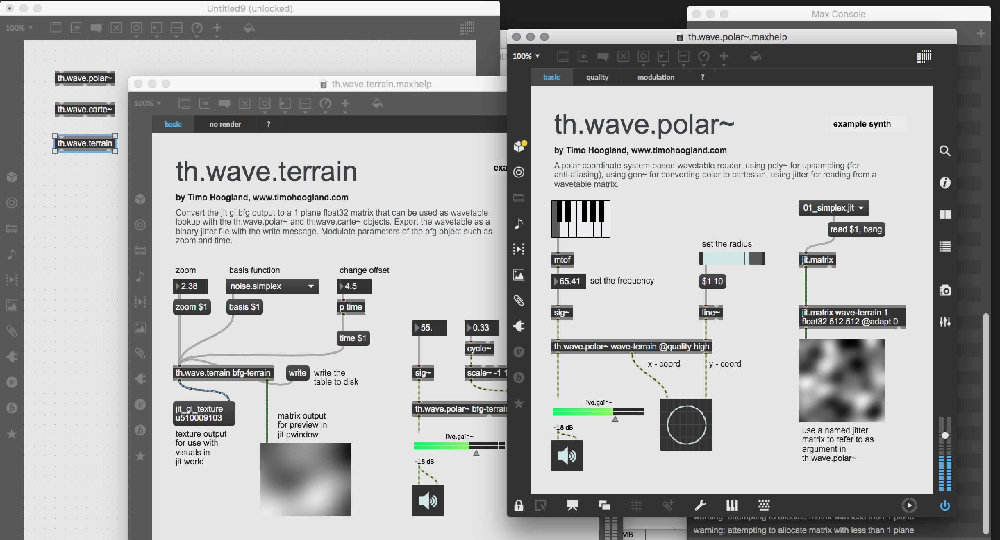

# wave-terrain-synthesis

**Please consider to [name a fair price](http://gumroad.com/tmhglnd)**

**or [become a patron](http://patreon.com/timohoogland)**

---

## About

A package of abstractions for polar, cartesian wavetable lookup and gl.bfg wavetable generation




## Contains

- **th.wave.polar~**

A polar coordinate system based wavetable reader, using poly~ for upsampling (for anti-aliasing), using gen~ for converting polar to cartesian, using jitter for reading from a wavetable matrix. Change the quality of the wavetable reader with the @quality attribute or with a message. Modulate the radius for some interesting sounds!

- **th.wave.carte~**

A cartesian coordinate system based wavetable reader, using poly~ for upsampling (for anti-aliasing), using jitter for reading from a wavetable matrix. The x-coordinate is a cosine wave scrubbing the x-axis back and forth resulting in a continuous wave. Change the quality of the wavetable reader with the @quality attribute or with a message. Modulate the radius for some interesting sounds!

- **th.wave.terrain**

Convert the jit.gl.bfg output to a 1 plane float32 matrix that can be used as wavetable lookup with the th.wave.polar~ and th.wave.carte~ objects. Export the wavetable as a binary jitter file with the write message for easy reuse in other patches without having to load OpenGL and run gl.bfg. Modulate parameters of the bfg object such as zoom and time.

- **wave-terrain-synth (example)**

This example patcher shows some of the possibilities for the th.wave.polar~ and th.wave.terrain objects. The th.wave.terrain takes the output of a gl.bfg object and converts it to a jit.matrix that can be read by the th.wave.polar~ object. The th.wave.polar~ object applies a circular lookup on the wavetable, for which the frequency and the radius can be set or modulated.

## Install

```
1. download zip
2. unzip and place in Max Library (on MacOS ~/Documents/Max 8/Library)
3. restart Max8, open a new patcher
```

```
1. open terminal
2. $ cd ~/Documents/Max\ 8/Library
3. $ git clone https://github.com/tmhglnd/wave-terrain-synthesis.git
4. restart Max8, open a new patcher
```

# License

The GNU Lesser GPL v.3

This program is distributed in the hope that it will be useful,
but WITHOUT ANY WARRANTY; without even the implied warranty of
MERCHANTABILITY or FITNESS FOR A PARTICULAR PURPOSE. See the
GNU General Public License for more details.
